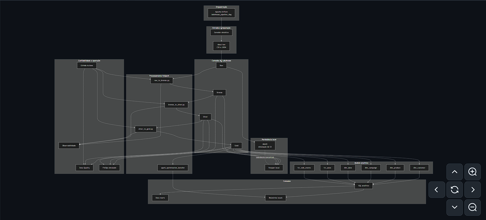
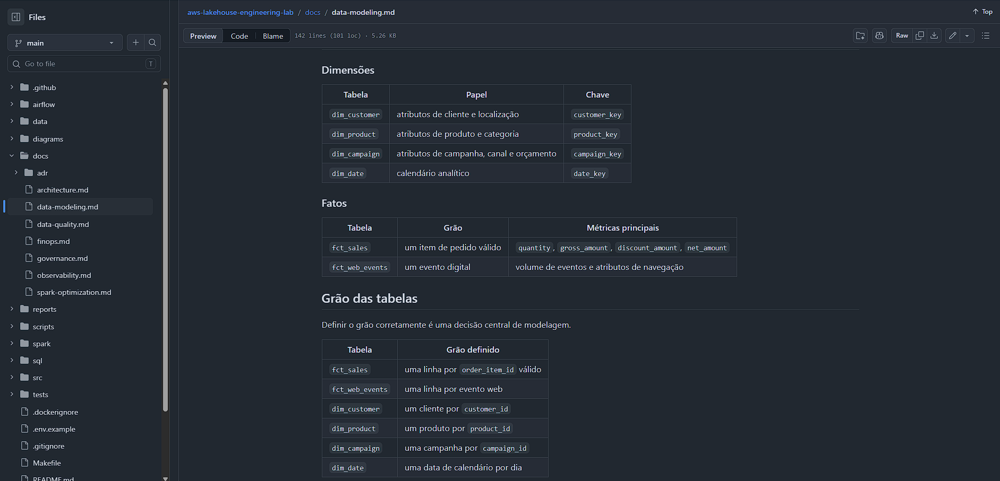
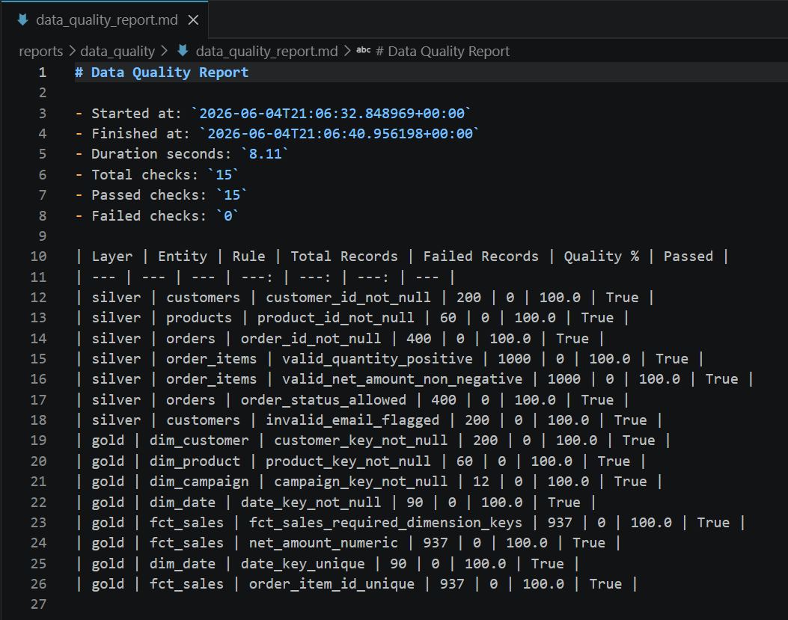
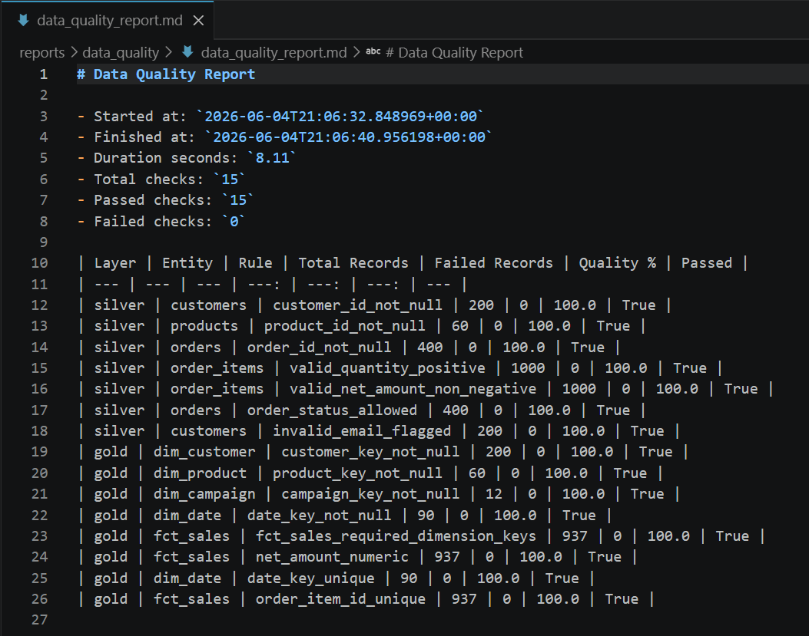
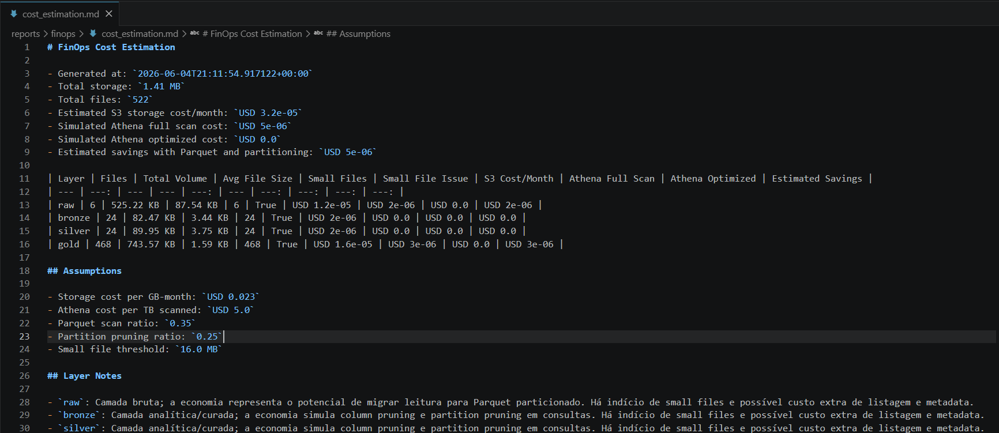
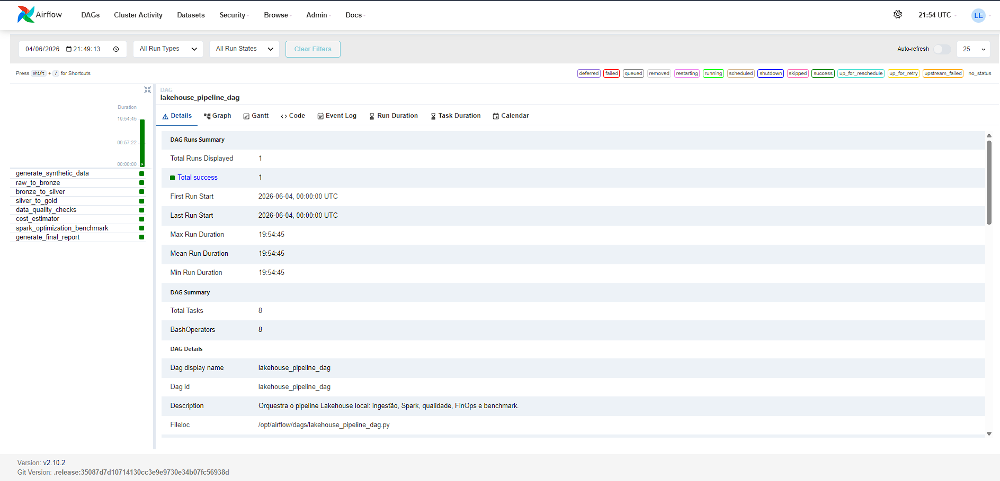
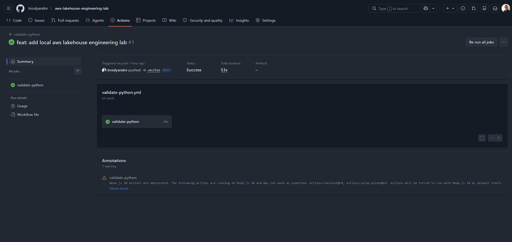
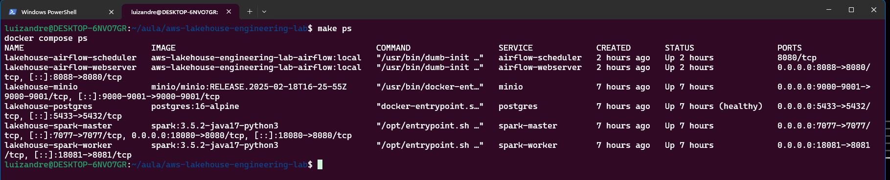
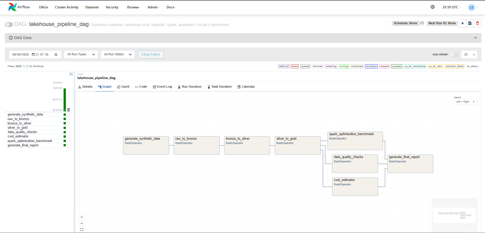

# AWS Lakehouse Engineering Lab

[](https://github.com/brodyandre/aws-lakehouse-engineering-lab/actions/workflows/validate-python.yml)
[](https://github.com/brodyandre/aws-lakehouse-engineering-lab/actions/workflows/validate-yaml.yml)
[](https://github.com/brodyandre/aws-lakehouse-engineering-lab/actions/workflows/run-tests.yml)
[](https://github.com/brodyandre/aws-lakehouse-engineering-lab/actions/workflows/data-quality.yml)

Laboratório técnico, local e gratuito, voltado para portfólio de Engenharia de Dados. O projeto simula uma arquitetura Lakehouse inspirada em boas práticas de AWS usando `MinIO`, `PySpark`, `Airflow`, `Parquet`, `Data Quality`, `Observabilidade`, `FinOps` e `GitHub Actions`, sem provisionar serviços reais em nuvem e sem custo de infraestrutura cloud.

<a id="índice"></a>

## Índice

- [Visão Geral](#visão-geral)
- [Objetivo do Projeto](#objetivo-do-projeto)
- [Problema de Negócio](#problema-de-negócio)
- [Solução Proposta](#solução-proposta)
- [Arquitetura](#arquitetura)
- [Stack Utilizada](#stack-utilizada)
- [Camadas do Lakehouse](#camadas-do-lakehouse)
- [Modelagem Analítica](#modelagem-analítica)
- [Pipeline de Dados](#pipeline-de-dados)
- [Otimização Spark](#otimização-spark)
- [Data Quality](#data-quality)
- [Observabilidade](#observabilidade)
- [FinOps](#finops)
- [Orquestração com Airflow](#orquestração-com-airflow)
- [CI/CD com GitHub Actions](#cicd-com-github-actions)
- [Como Executar Localmente](#como-executar-localmente)
- [Estrutura do Projeto](#estrutura-do-projeto)
- [Competências Demonstradas](#competências-demonstradas)
- [Como Este Projeto Demonstra Requisitos de Vagas](#como-este-projeto-demonstra-requisitos-de-vagas)
- [Evidências Esperadas](#evidências-esperadas)
- [Roadmap](#roadmap)
- [Limitações](#limitações)
- [Próximos Passos](#próximos-passos)
- [Como Este Projeto Simula AWS Sem Custo](#como-este-projeto-simula-aws-sem-custo)

<a id="visão-geral"></a>

## Visão Geral

`aws-lakehouse-engineering-lab` demonstra como estruturar um pipeline analítico moderno em um laboratório reproduzível e local-first. O foco do projeto é mostrar organização por camadas, modelagem dimensional, processamento distribuído, governança mínima, automação e rastreabilidade operacional de forma honesta, sem afirmar uso produtivo de AWS, Databricks ou ambientes corporativos reais.

O laboratório foi pensado para recrutadores, líderes técnicos e profissionais de dados que queiram avaliar capacidade de arquitetura, implementação e documentação em um projeto consistente de portfólio.

[⬆️ Voltar ao índice](#índice)

<a id="objetivo-do-projeto"></a>

## Objetivo do Projeto

Criar um laboratório 100% local, gratuito e reproduzível que simule uma arquitetura Lakehouse inspirada em AWS para cenários de e-commerce e marketing. O projeto busca evidenciar boas práticas de Engenharia de Dados em ingestão, transformação, qualidade, observabilidade, custo e automação sem depender de cloud real.

[⬆️ Voltar ao índice](#índice)

<a id="problema-de-negócio"></a>

## Problema de Negócio

Times de dados frequentemente precisam transformar eventos operacionais, campanhas, pedidos e comportamento digital em uma base analítica confiável para responder perguntas como:

- quais categorias e campanhas geram mais receita;
- quais clientes têm maior valor;
- como garantir qualidade antes do consumo analítico;
- como medir execução, custo e performance sem depender de serviços pagos;
- como demonstrar uma arquitetura moderna de dados com clareza técnica e baixo custo.

[⬆️ Voltar ao índice](#índice)

<a id="solução-proposta"></a>

## Solução Proposta

O projeto propõe um pipeline Lakehouse local-first com:

- geração de dados sintéticos consistentes entre entidades de negócio;
- camadas `Raw`, `Bronze`, `Silver` e `Gold`;
- processamento distribuído local com `PySpark`;
- modelagem analítica em `Star Schema`;
- orquestração com `Apache Airflow`;
- validações automatizadas de `Data Quality`;
- observabilidade baseada em métricas, logs e relatórios locais;
- simulação de `FinOps` por volume de arquivos;
- validação contínua com `GitHub Actions`.

[⬆️ Voltar ao índice](#índice)

<a id="arquitetura"></a>

## Arquitetura

Resumo do fluxo:

1. dados sintéticos são gerados em `data/raw`;
2. o `MinIO` simula object storage S3-compatible;
3. jobs `PySpark` promovem os dados entre `Raw`, `Bronze`, `Silver` e `Gold`;
4. a camada `Gold` materializa fatos e dimensões em `Star Schema`;
5. o `Airflow` orquestra o pipeline ponta a ponta;
6. Data Quality, Observabilidade, FinOps e benchmark geram evidências em `reports/`;
7. o `GitHub Actions` valida código, YAML, testes e qualidade mínima do pipeline.

Documentação complementar:

- [Arquitetura detalhada](docs/architecture.md)
- [Diagrama Mermaid](diagrams/architecture.md)

<p align="center">
  
</p>
<p align="center"><em>Arquitetura local do laboratório com MinIO, PySpark, Airflow e camadas Raw, Bronze, Silver e Gold.</em></p>


[⬆️ Voltar ao índice](#índice)

<a id="stack-utilizada"></a>

## Stack Utilizada

| Categoria | Tecnologia | Papel no projeto |
| --- | --- | --- |
| Object storage local | MinIO | Simula buckets e fluxo estilo S3 |
| Processamento distribuído | PySpark | Ingestão, transformação e publicação entre camadas |
| Orquestração | Apache Airflow | Agenda, dependências, retries e histórico de execução |
| Formato analítico | Parquet | Persistência colunar em Bronze, Silver e Gold |
| Modelagem analítica | SQL + Star Schema | Camada Gold e consultas de negócio |
| Qualidade de dados | PySpark + testes | Validação de consistência em Silver e Gold |
| Observabilidade | Relatórios JSON e Markdown | Evidência operacional local |
| FinOps | Estimador local de custo | Simulação de storage, scan e otimização |
| CI/CD | GitHub Actions | Lint, testes, YAML e Data Quality em pipeline público |
| Ambiente | Docker Compose | Execução local reproduzível |

[⬆️ Voltar ao índice](#índice)

<a id="camadas-do-lakehouse"></a>

## Camadas do Lakehouse

| Camada | Objetivo | Características principais |
| --- | --- | --- |
| `Raw` | Receber dados de origem | Dados próximos do original, em `CSV` e `JSON` |
| `Bronze` | Padronização estrutural mínima | Conversão para `Parquet`, colunas técnicas e rastreabilidade |
| `Silver` | Conformidade e qualidade | Tipagem, padronização, sinalização de inválidos e regras de negócio |
| `Gold` | Consumo analítico | Fatos, dimensões, métricas e consultas de negócio |

[⬆️ Voltar ao índice](#índice)

<a id="modelagem-analítica"></a>

## Modelagem Analítica

A camada `Gold` foi desenhada em `Star Schema` para simplificar análise, leitura por ferramentas de BI e comunicação com públicos analíticos. O modelo centraliza métricas de negócio em fatos e atributos descritivos em dimensões.

Tabelas principais:

- dimensões: `dim_customer`, `dim_product`, `dim_campaign`, `dim_date`;
- fatos: `fct_sales`, `fct_web_events`.

Perguntas de negócio suportadas:

- receita por categoria;
- receita por mês;
- performance de campanhas;
- top clientes;
- comportamento digital por canal e sessão.

Mais detalhes em [docs/data-modeling.md](docs/data-modeling.md).

<p align="center">
  
</p>
<p align="center"><em>Exemplo de visão da camada Gold com dimensões e fatos analíticos.</em></p>


[⬆️ Voltar ao índice](#índice)

<a id="pipeline-de-dados"></a>

## Pipeline de Dados

Fluxo principal do laboratório:

1. `generate_synthetic_data`
2. `raw_to_bronze`
3. `bronze_to_silver`
4. `silver_to_gold`
5. `data_quality_checks`
6. `cost_estimator`
7. `spark_optimization_benchmark`, opcional
8. `generate_final_report`

Esse encadeamento permite demonstrar ingestão, transformação, consumo analítico e geração de evidências técnicas em uma mesma trilha operacional.

[⬆️ Voltar ao índice](#índice)

<a id="otimização-spark"></a>

## Otimização Spark

O projeto usa `PySpark` para transformar dados entre camadas e materializar a camada analítica. Além da funcionalidade, o laboratório inclui um benchmark dedicado para comparar uma execução não otimizada com outra otimizada.

Técnicas demonstradas:

- `cache`;
- `broadcast join`;
- ajuste de `shuffle partitions`;
- `repartition` e `coalesce`;
- `Adaptive Query Execution`;
- `column pruning`.

Mais detalhes em [docs/spark-optimization.md](docs/spark-optimization.md).

[⬆️ Voltar ao índice](#índice)

<a id="data-quality"></a>

## Data Quality

A camada de Data Quality valida `Silver` e `Gold` com regras automatizadas de:

- completude;
- validade;
- consistência;
- unicidade;
- integridade mínima para consumo analítico.

Artefatos gerados:

- `reports/data_quality/data_quality_report.md`
- `reports/data_quality/data_quality_results.json`

Mais detalhes em [docs/data-quality.md](docs/data-quality.md).

<p align="center">
  
</p>
<p align="center"><em>Relatório de qualidade de dados com regras aplicadas nas camadas Silver e Gold.</em></p>


[⬆️ Voltar ao índice](#índice)

<a id="observabilidade"></a>

## Observabilidade

O projeto registra evidências operacionais por execução com foco em:

- duração dos jobs;
- volumes de entrada e saída;
- registros inválidos;
- artefatos gerados;
- tamanho aproximado dos arquivos;
- status `success`, `warning` ou `failed`.

Artefatos gerados:

- `reports/observability/pipeline_metrics.md`
- `reports/observability/pipeline_metrics.json`

Mais detalhes em [docs/observability.md](docs/observability.md).

<p align="center">
  
</p>
<p align="center"><em>Métricas de execução com duração, volume processado e status dos jobs.</em></p>


[⬆️ Voltar ao índice](#índice)

<a id="finops"></a>

## FinOps

O módulo de FinOps simula custo de dados sem usar AWS real e sem consultar billing. A lógica usa apenas o volume de arquivos local para estimar:

- storage estilo S3;
- scan estilo Athena;
- risco de `small files`;
- economia potencial com `Parquet` e particionamento.

Artefatos gerados:

- `reports/finops/cost_estimation.md`
- `reports/finops/cost_estimation.json`

Mais detalhes em [docs/finops.md](docs/finops.md).

<p align="center">
  
</p>
<p align="center"><em>Simulação local de FinOps com estimativas de storage, scan e economia por otimização.</em></p>


[⬆️ Voltar ao índice](#índice)

<a id="orquestração-com-airflow"></a>

## Orquestração com Airflow

O pipeline principal é orquestrado pela DAG `lakehouse_pipeline_dag`, localizada em [airflow/dags/lakehouse_pipeline_dag.py](airflow/dags/lakehouse_pipeline_dag.py).

Por padrão, os jobs Spark executados pela DAG usam `local[*]` dentro do container do Airflow para priorizar reprodutibilidade no laboratório local. O cluster `Spark Master/Worker` continua disponível para exploração, troubleshooting e benchmarks, e pode ser usado pela DAG ao definir `AIRFLOW_SPARK_MASTER_URL=spark://spark-master:7077`.

Objetivos da orquestração:

- materializar dependências entre etapas;
- tornar reexecução mais previsível;
- evidenciar retries e status de tasks;
- aproximar a experiência local do tipo de operação esperado em ambientes gerenciados.

<p align="center">
  
</p>
<p align="center"><em>Orquestração do pipeline completo no Airflow local.</em></p>


[⬆️ Voltar ao índice](#índice)

<a id="cicd-com-github-actions"></a>

## CI/CD com GitHub Actions

O repositório inclui workflows públicos para:

| Workflow | Objetivo |
| --- | --- |
| `validate-python.yml` | lint de Python e testes unitários |
| `validate-yaml.yml` | validação de YAML, Compose e workflows |
| `run-tests.yml` | testes unitários e integrações leves |
| `data-quality.yml` | pipeline reduzido com geração de dados e validações de qualidade |

Além da automação, o projeto registra decisões e troubleshooting em artefatos úteis para avaliação técnica:

- ADRs em `docs/adr/`;
- documentação temática em `docs/`;
- scripts operacionais em `scripts/`;
- `Makefile` para padronizar comandos recorrentes.

<p align="center">
  
</p>
<p align="center"><em>Validações automatizadas de lint, testes, YAML e Data Quality no GitHub Actions.</em></p>


[⬆️ Voltar ao índice](#índice)

<a id="como-executar-localmente"></a>

## Como Executar Localmente

### Pré-requisitos

- `Docker`
- `Docker Compose`
- `Python 3.10+`
- `make`

### Subindo o ambiente

```bash
cp .env.example .env
make init
make up
```

### Preparando ambiente Python local

```bash
make setup-dev
source .venv/bin/activate
```

### Validando o ambiente e rodando o pipeline local

```bash
make check
make run-local
make final-report
```

### Limpando saídas geradas

```bash
make clean-outputs
```

### Acessos locais

| Componente | URL |
| --- | --- |
| Airflow | `http://localhost:8088` |
| MinIO API | `http://localhost:9000` |
| MinIO Console | `http://localhost:9001` |
| Spark Master UI | `http://localhost:18080` |
| Spark Worker UI | `http://localhost:18081` |

Credenciais locais padrão:

- Airflow usuário: `admin`
- Airflow senha: `admin`
- MinIO usuário: `minioadmin`
- MinIO senha: `minioadmin123`

<p align="center">
  
</p>
<p align="center"><em>Exemplo da stack local com Airflow, MinIO e Spark ativos.</em></p>


### Executando o pipeline por etapas

Gerar dados sintéticos:

```bash
python3 src/ingestion/generate_synthetic_data.py
```

Promover `Raw` para `Bronze`:

```bash
python3 spark/jobs/raw_to_bronze.py
```

Promover `Bronze` para `Silver`:

```bash
python3 spark/jobs/bronze_to_silver.py
```

Promover `Silver` para `Gold`:

```bash
python3 spark/jobs/silver_to_gold.py
```

Executar Data Quality:

```bash
python3 src/quality/data_quality_checks.py \
  --silver-dir data/silver \
  --gold-dir data/gold \
  --report-path reports/data_quality/data_quality_report.md \
  --json-path reports/data_quality/data_quality_results.json \
  --master local[*]
```

Executar FinOps simulado:

```bash
python3 src/finops/cost_estimator.py
```

Executar benchmark Spark:

```bash
python3 spark/benchmarks/spark_optimization_benchmark.py \
  --gold-dir data/gold \
  --report-path reports/pipeline_runs/spark_optimization_benchmark.md \
  --master local[*]
```

### Executando pelo Airflow

1. abra `http://localhost:8088`;
2. entre com `admin / admin`;
3. localize a DAG `lakehouse_pipeline_dag`;
4. despause a DAG, se necessário;
5. acione uma execução manual.

<p align="center">
  
</p>
<p align="center"><em>Execução da DAG com tasks concluídas com sucesso.</em></p>


[⬆️ Voltar ao índice](#índice)

<a id="estrutura-do-projeto"></a>

## Estrutura do Projeto

```text
aws-lakehouse-engineering-lab/
├── assets/
├── airflow/
├── data/
├── diagrams/
├── docs/
├── reports/
├── scripts/
├── spark/
├── sql/
├── src/
├── tests/
├── .github/workflows/
├── docker-compose.yml
├── Makefile
├── pyproject.toml
├── requirements.txt
└── README.md
```

Áreas principais:

- `src/`: configuração, geração de dados, qualidade, observabilidade e FinOps;
- `spark/jobs/`: jobs `Raw -> Bronze -> Silver -> Gold`;
- `spark/benchmarks/`: benchmark de otimização Spark;
- `airflow/dags/`: orquestração do pipeline;
- `docs/`: documentação temática e ADRs;
- `assets/screenshots/readme/`: evidências visuais do README organizadas por tema;
- `sql/`: DDL, analytics e data marts;
- `tests/`: testes unitários, integração e Data Quality.

[⬆️ Voltar ao índice](#índice)

<a id="competências-demonstradas"></a>

## Competências Demonstradas

| Competência | Como é demonstrada neste projeto | Evidências principais |
| --- | --- | --- |
| Arquitetura de dados em nuvem AWS | Simulação local de uma arquitetura inspirada em AWS, com object storage S3-compatible, camadas de lakehouse, processamento distribuído e orquestração. | `docs/architecture.md`, `diagrams/architecture.md`, ADRs |
| Data Lake / Lakehouse | Organização por camadas `Raw`, `Bronze`, `Silver` e `Gold`, com separação clara entre ingestão, conformidade e consumo analítico. | `data/`, jobs Spark, documentação de arquitetura |
| PySpark | Jobs de ingestão, transformação e modelagem analítica implementados em Spark local. | `spark/jobs/` |
| Otimização Spark | Benchmark comparando execução não otimizada e otimizada com `cache`, `broadcast`, `AQE`, `repartition` e `coalesce`. | `spark/benchmarks/`, `docs/spark-optimization.md` |
| Modelagem Star Schema | Construção de dimensões e fatos analíticos para consumo por SQL e BI. | `spark/jobs/silver_to_gold.py`, `sql/ddl/`, `docs/data-modeling.md` |
| Orquestração com Airflow | DAG local com dependências, retries e pipeline completo ponta a ponta. | `airflow/dags/lakehouse_pipeline_dag.py` |
| Data Quality | Regras automatizadas para Silver e Gold, com relatórios em Markdown e JSON. | `src/quality/`, `tests/data_quality/`, `reports/data_quality/` |
| Observabilidade | Coleta de métricas de execução, status, volumes processados e artefatos gerados. | `src/observability/`, `reports/observability/` |
| FinOps | Estimativa local de custo de storage e scan, análise de small files e economia com Parquet e particionamento. | `src/finops/`, `docs/finops.md`, `reports/finops/` |
| CI/CD | Workflows públicos para lint, YAML, testes e Data Quality em ambiente automatizado. | `.github/workflows/` |
| Versionamento | Estrutura organizada para evolução incremental, automação e colaboração em repositório público. | GitHub Actions, convenções de projeto, `Makefile` |
| Argumentação técnica | Decisões arquiteturais registradas com contexto, alternativas e trade-offs. | `docs/adr/` |
| Documentação profissional e troubleshooting | Documentação técnica em português, scripts operacionais, checagem de ambiente e limpeza de saídas. | `README.md`, `docs/`, `scripts/check_environment.sh`, `scripts/run_pipeline_local.sh` |

[⬆️ Voltar ao índice](#índice)

<a id="como-este-projeto-demonstra-requisitos-de-vagas"></a>

## Como Este Projeto Demonstra Requisitos de Vagas

| Requisito de vaga | Como este projeto demonstra |
| --- | --- |
| Experiência com arquitetura de dados em nuvem AWS | Simula localmente um Lakehouse inspirado em AWS usando MinIO como object storage S3-compatible, camadas Bronze/Silver/Gold e documentação arquitetural. |
| Conhecimento em Data Lake / Lakehouse | Estrutura o pipeline em camadas com responsabilidades claras, rastreabilidade e dados analíticos materializados em Parquet. |
| Experiência com PySpark | Implementa jobs para ingestão, limpeza, transformação e modelagem analítica com Spark local. |
| Otimização de processamento distribuído | Compara uma abordagem não otimizada e outra otimizada com técnicas clássicas de tuning em Spark. |
| Modelagem dimensional | Constrói `dim_customer`, `dim_product`, `dim_campaign`, `dim_date`, `fct_sales` e `fct_web_events` em `Star Schema`. |
| Orquestração de pipelines | Encadeia as etapas do laboratório em uma DAG Airflow com dependências, retries e execução manual ou agendada. |
| Data Quality | Automatiza regras para Silver e Gold, gerando relatórios e testes específicos de qualidade. |
| Observabilidade de dados | Registra métricas de execução, volumes, inválidos, artefatos e status por job. |
| Controle de custos em dados | Simula FinOps com estimativas de storage, scan, small files e economia com Parquet e particionamento. |
| CI/CD e automação | Usa GitHub Actions para validar código, YAML, testes e Data Quality sem depender de serviços pagos. |
| Documentação e comunicação técnica | Explica arquitetura, governança, modelagem, otimização, FinOps e decisões arquiteturais em linguagem objetiva e profissional. |
| Capacidade de troubleshooting e operação local | Inclui scripts para validar ambiente, executar o pipeline ponta a ponta, limpar saídas e consolidar relatório final. |

[⬆️ Voltar ao índice](#índice)

<a id="evidências-esperadas"></a>

## Evidências Esperadas

Ao executar o laboratório, espera-se gerar evidências técnicas como:

- relatórios de pipeline em `reports/pipeline_runs/`;
- relatórios de Data Quality em `reports/data_quality/`;
- métricas de observabilidade em `reports/observability/`;
- estimativas de FinOps em `reports/finops/`;
- datasets `Parquet` em `data/bronze`, `data/silver` e `data/gold`;
- histórico de execução e dependências no Airflow;
- validações automatizadas no GitHub Actions.

### Guia para Inserção de Screenshots

Para enriquecer o README sem poluir a narrativa, o ideal é usar de `6` a `9` capturas principais, sempre em `PNG`, com largura consistente e foco em uma mensagem por imagem.

Pasta recomendada:

- `assets/screenshots/readme/`

Hierarquia sugerida:

```text
assets/screenshots/readme/
├── architecture/
├── cicd/
├── data-quality/
├── finops/
├── modeling/
├── observability/
├── orchestration/
└── runtime/
```

Ordem sugerida de arquivos:

| Ordem | Arquivo sugerido | Onde inserir | Objetivo visual |
| --- | --- | --- | --- |
| 1 | `architecture/01-readme-architecture-overview.png` | `Arquitetura` | Mostrar visão sistêmica do laboratório |
| 2 | `modeling/02-readme-gold-star-schema-overview.png` | `Modelagem Analítica` | Evidenciar fatos e dimensões |
| 3 | `data-quality/03-readme-data-quality-report.png` | `Data Quality` | Mostrar regras e evidências de qualidade |
| 4 | `observability/04-readme-observability-metrics.png` | `Observabilidade` | Mostrar métricas operacionais |
| 5 | `finops/05-readme-finops-cost-estimation.png` | `FinOps` | Mostrar custo simulado e small files |
| 6 | `orchestration/06-readme-airflow-dag.png` | `Orquestração com Airflow` | Mostrar a DAG e o encadeamento |
| 7 | `cicd/07-readme-github-actions-workflows.png` | `CI/CD com GitHub Actions` | Mostrar os checks do repositório |
| 8 | `runtime/08-readme-local-services-overview.png` | `Como Executar Localmente` | Mostrar a stack local ativa |
| 9 | `orchestration/09-readme-airflow-run-success.png` | `Como Executar Localmente` | Mostrar uma execução bem-sucedida |

Como usar:

1. capture a tela com foco em legibilidade;
2. recorte bordas e elementos irrelevantes;
3. salve o arquivo com o nome sugerido dentro da subpasta temática correspondente;
4. ajuste o `src` da imagem no README quando trocar o arquivo ou adicionar uma nova evidência;
5. mantenha nomes previsíveis para facilitar manutenção e navegação no GitHub.

[⬆️ Voltar ao índice](#índice)

<a id="roadmap"></a>

## Roadmap

- [x] Estrutura inicial do laboratório
- [x] Stack local com MinIO, Spark, Airflow e Postgres
- [x] Geração de dados sintéticos
- [x] Jobs `Raw -> Bronze -> Silver -> Gold`
- [x] Modelagem dimensional em Star Schema
- [x] Data Quality automatizado
- [x] Observabilidade local
- [x] FinOps simulado
- [x] Benchmark de otimização Spark
- [x] DAG do Airflow
- [x] Workflows de GitHub Actions
- [ ] Ampliar cobertura de testes para benchmark e DAG
- [ ] Adicionar data marts derivados e cenários analíticos extras
- [ ] Criar dashboards locais para observabilidade e consumo analítico

[⬆️ Voltar ao índice](#índice)

<a id="limitações"></a>

## Limitações

- não usa AWS real;
- não usa Databricks real;
- não usa billing real;
- não reproduz elasticidade, IAM, networking gerenciado ou SLAs de nuvem;
- benchmark Spark depende da disponibilidade de `pyspark` e `java`;
- os números de performance e custo são indicativos, não equivalentes a produção;
- o projeto foi desenhado como laboratório local robusto, não como benchmark oficial de escala.

[⬆️ Voltar ao índice](#índice)

<a id="próximos-passos"></a>

## Próximos Passos

- adicionar datasets públicos ou cenários de domínio adicionais;
- publicar dashboards locais em DuckDB ou Streamlit;
- incluir compactação e manutenção de partições como parte do pipeline;
- ampliar o benchmark com skew, small files e variações de partição;
- enriquecer a DAG com sensores, notificações locais e ramificações de execução.

[⬆️ Voltar ao índice](#índice)

<a id="como-este-projeto-simula-aws-sem-custo"></a>

## Como Este Projeto Simula AWS Sem Custo

| Conceito AWS | Simulação local neste projeto |
| --- | --- |
| Amazon S3 | MinIO |
| Data Lake em S3 | diretórios locais + Parquet + MinIO |
| Glue / EMR / jobs Spark | PySpark em ambiente local |
| MWAA / Airflow gerenciado | Airflow em Docker |
| CloudWatch Logs e métricas | logs locais + relatórios Markdown/JSON |
| Athena | consultas simuladas e estimativas de scan |
| Cost Explorer / billing | FinOps local por volume de arquivos |
| CI/CD corporativo | GitHub Actions público |

O valor do projeto está em demonstrar raciocínio arquitetural, organização por camadas, automação, qualidade, observabilidade e clareza técnica sem custo de cloud e sem dependência de serviços pagos.

[⬆️ Voltar ao índice](#índice)
