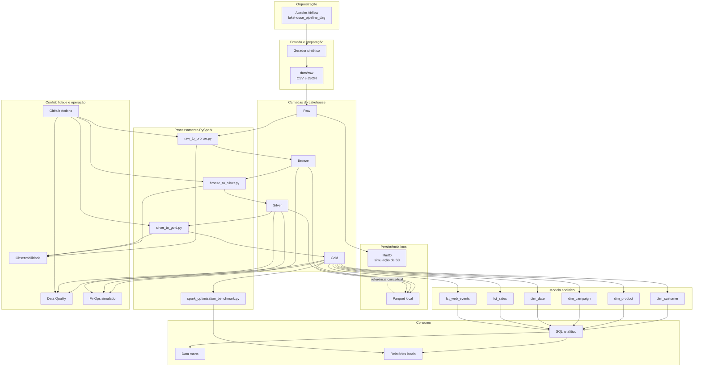

# Diagrama de arquitetura

## Leitura rápida

- `MinIO` representa o papel conceitual do `S3`.
- `Raw`, `Bronze`, `Silver` e `Gold` estruturam a evolução do dado.
- `PySpark` move os dados entre camadas.
- `Airflow` orquestra o pipeline ponta a ponta.
- `Data Quality`, `Observabilidade` e `FinOps` geram evidências operacionais.
- `GitHub Actions` valida qualidade técnica do repositório.
