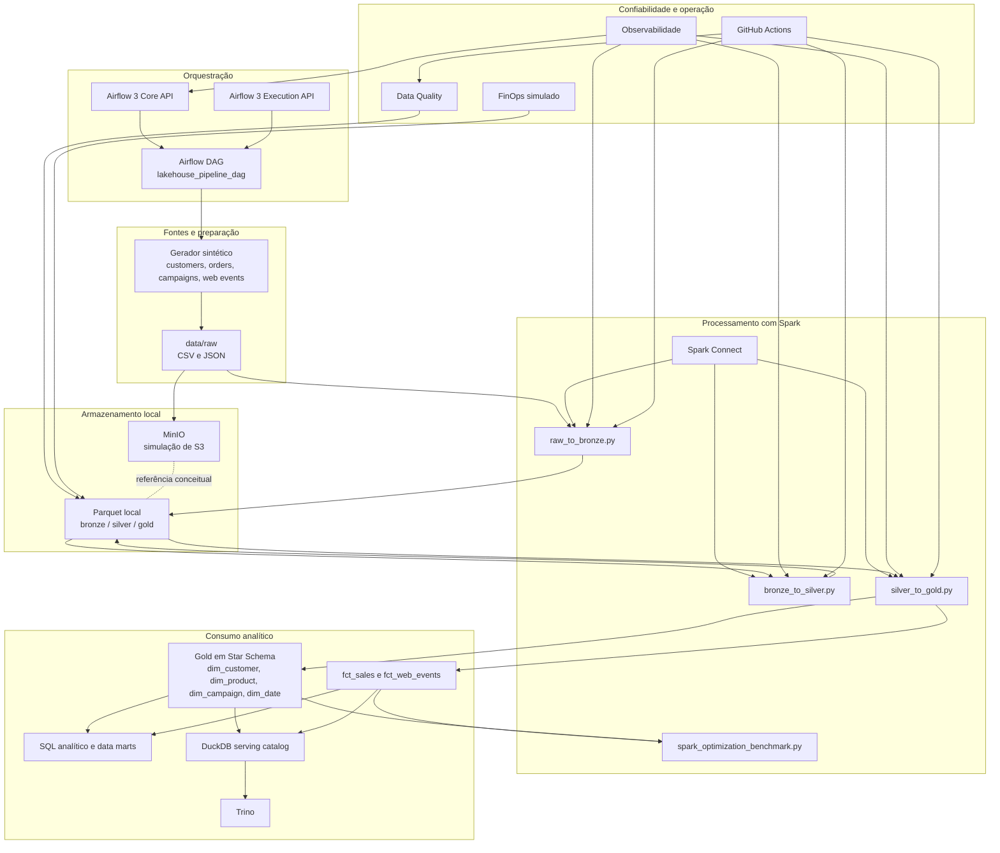

# Arquitetura do laboratório

## Objetivo da arquitetura

Este laboratório implementa uma arquitetura Lakehouse local-first para demonstrar boas práticas de engenharia de dados sem uso de AWS real, serviços pagos ou infraestrutura gerenciada. O foco está em reproduzir conceitos arquiteturais relevantes para um ambiente moderno de dados:

- separação por camadas;
- object storage;
- processamento distribuído;
- modelagem analítica;
- orquestração;
- qualidade;
- observabilidade;
- governança;
- FinOps.

É uma simulação técnica local, não uma afirmação de experiência produtiva em AWS.

## Arquitetura em texto

O fluxo arquitetural parte de dados sintéticos de e-commerce e marketing, gerados em `data/raw`. Esses arquivos representam o papel de uma zona de aterrissagem de dados. O MinIO simula o comportamento de um armazenamento estilo S3, enquanto o PySpark materializa as transições entre as camadas Bronze, Silver e Gold em Parquet.

No topo do fluxo, o `Spark Connect` desacopla os clientes Spark do cluster local como endpoint opcional de experimentação, o `Airflow 3` separa `core API` e `execution API` para uma topologia mais modular, e a camada de `DuckDB + Trino` publica a Gold para exploração SQL. Ao final da execução, módulos de Data Quality, Observabilidade e FinOps geram relatórios locais em Markdown e JSON, criando evidências técnicas semelhantes ao que times de dados acompanham em ambientes corporativos.

## Diagrama Mermaid

## Explicação do fluxo

### 1. Geração e aterrissagem

O processo começa com a geração de dados sintéticos em `data/raw`, simulando um cenário de e-commerce e marketing. Esses dados são mantidos próximos da origem, sem transformação semântica forte.

### 2. Raw para Bronze

O job `raw_to_bronze.py` lê CSV e JSON da camada Raw e grava cada entidade em Parquet. Nessa etapa, o objetivo é adicionar rastreabilidade técnica e padronização estrutural mínima.

### 3. Bronze para Silver

O job `bronze_to_silver.py` aplica limpeza, tipagem, padronização e sinalização de dados inválidos. A Silver funciona como camada conformada para regras de negócio e contratos de dados.

### 4. Silver para Gold

O job `silver_to_gold.py` constrói a camada analítica em Star Schema, com dimensões e fatos voltados a consumo por SQL, BI e análises de negócio.

### 5. Data Quality

Depois da materialização analítica, o projeto executa checagens automatizadas em Silver e Gold. Isso ajuda a validar completude, consistência, unicidade e confiabilidade mínima para consumo.

### 6. Observabilidade

Cada job principal gera métricas operacionais locais, permitindo acompanhar duração, volumes, status, arquivos gerados e percentual de dados válidos.

### 7. FinOps simulado

O módulo de FinOps usa apenas o filesystem local para estimar custo estilo S3 e Athena, sinalizando também risco de `small files` e economia potencial com Parquet e particionamento.

### 8. Serving e Query

Depois da Gold, o laboratório materializa um catálogo `DuckDB` em `data/serving/lakehouse.duckdb` e publica tabelas analíticas para exploração via `Trino`. Essa camada melhora a narrativa de portfólio porque fecha o ciclo entre transformação e consumo.

### 9. Benchmark Spark

O benchmark compara uma abordagem Spark ingênua com outra otimizada, reforçando boas práticas de performance sem depender de cluster pago.

## Orquestração

O pipeline operacional é materializado na DAG [airflow/dags/lakehouse_pipeline_dag.py](/home/luizandre/aula/aws-lakehouse-engineering-lab/airflow/dags/lakehouse_pipeline_dag.py) com `dag_id` `lakehouse_pipeline_dag`.

Sequência da DAG:

1. `generate_synthetic_data`
2. `raw_to_bronze`
3. `bronze_to_silver`
4. `silver_to_gold`
5. `data_quality_checks`
6. `cost_estimator`
7. `build_serving_catalog`
8. `spark_optimization_benchmark`, opcional
9. `generate_final_report`

Decisões de desenho:

- `BashOperator` para reaproveitar scripts já existentes e manter execução simples no ambiente local;
- separação entre `core API` e `execution API` do Airflow 3 para aproximar a topologia de um ambiente moderno;
- `Spark Connect` como endpoint opcional de experimentação; por causa de uma regressão de serialização observada no Spark `3.5.x` com cluster standalone, a DAG usa `spark://spark-master:7077` por padrão e mantém `SPARK_REMOTE` vazio até nova estabilização;
- execução manual por padrão, com possibilidade de mudar para agendamento diário;
- `retries` configurados para aproximar o comportamento de pipelines corporativos.

## Paralelo entre ambiente local e AWS real

| Ambiente local | Paralelo conceitual em AWS | Papel no projeto |
| --- | --- | --- |
| MinIO | Amazon S3 | simular object storage |
| Parquet local | Data Lake em S3 | representar persistência analítica colunar |
| Spark Connect | client/server Spark | desacoplar cliente e cluster |
| Airflow 3 local | MWAA ou Airflow gerenciado | orquestrar jobs e dependências |
| Trino local | query engine analítico | publicar consumo SQL |
| Logs locais | CloudWatch Logs | rastrear execução e troubleshooting |
| Relatórios locais | observabilidade corporativa | materializar evidências operacionais |
| Testes locais | etapa de CI/CD | validar regressão antes de mudanças |

## O que o laboratório demonstra

Do ponto de vista técnico, a arquitetura demonstra:

- separação disciplinada por camadas;
- processamento distribuído reprodutível;
- organização analítica orientada a consumo;
- preocupação com qualidade, custo e operação;
- capacidade de explicar o equivalente conceitual entre ambiente local e serviços AWS.

## Limites da simulação

O laboratório não pretende reproduzir:

- elasticidade real de cloud;
- políticas de IAM;
- billing real;
- SLAs gerenciados;
- observabilidade distribuída com telemetria centralizada;
- maturidade completa de produção.

O objetivo é ser um ambiente de aprendizado aplicado, documentação e demonstração de raciocínio arquitetural.
